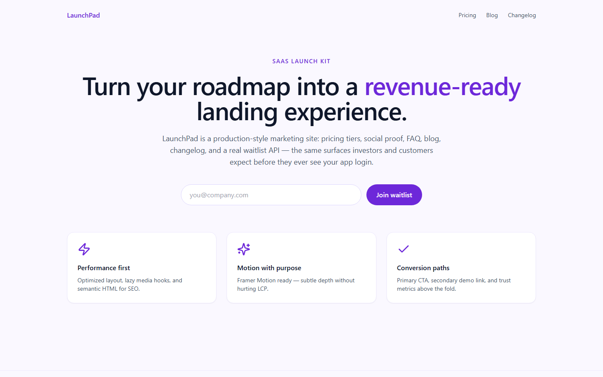
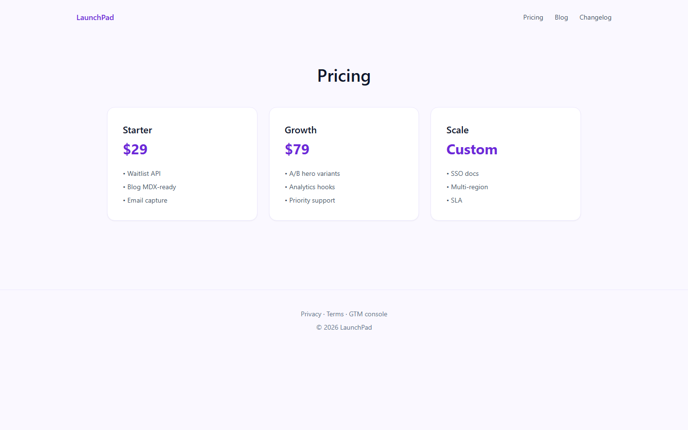
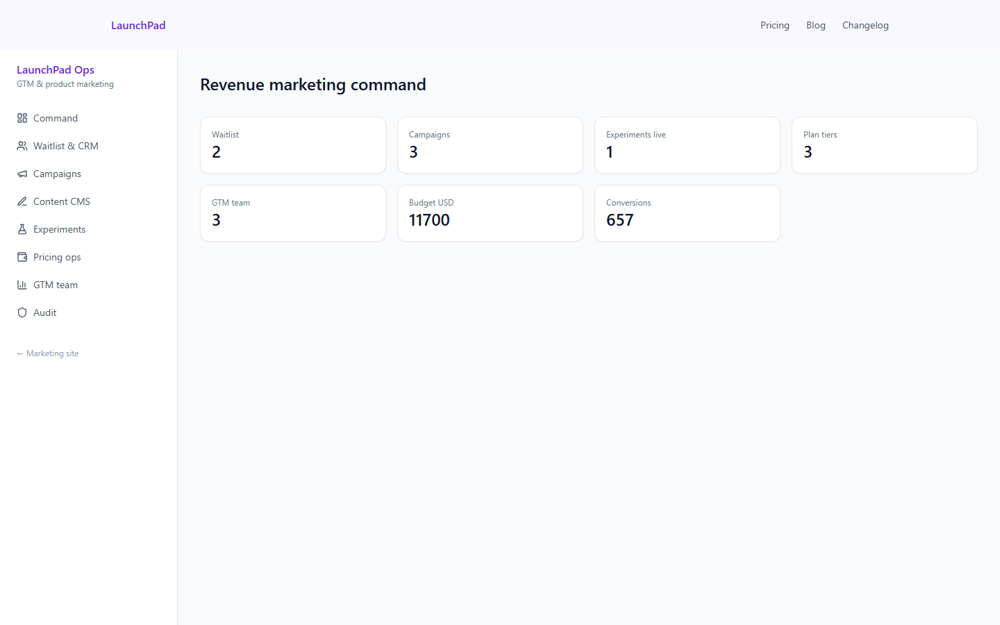
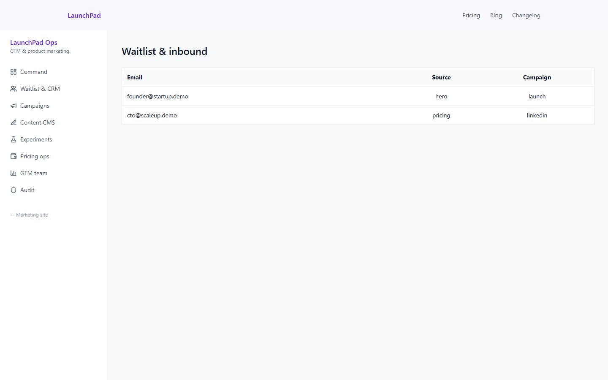
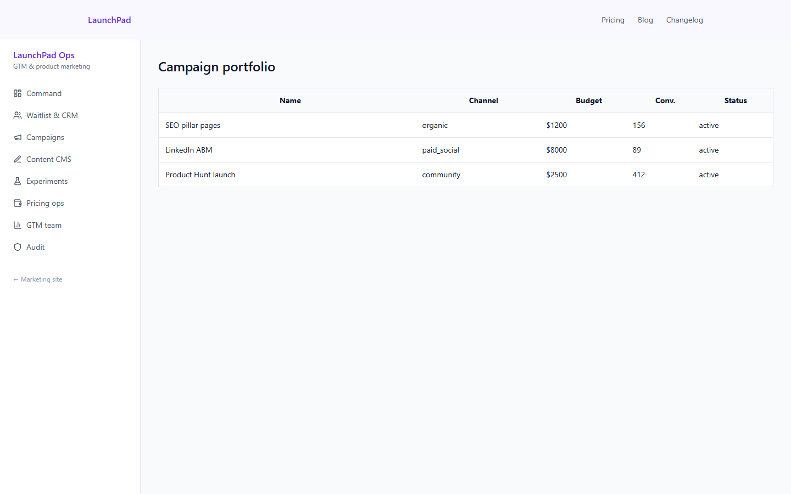

# LaunchPad — SaaS GTM & marketing product







Public **marketing site** (home, features, pricing, customers, integrations, blog, changelog, legal pages, waitlist form) plus an **8-module GTM console** on Prisma/SQLite. Built with Next.js (App Router) by **Alexsandro Sunaga**.

## Marketing (public)

http://localhost:3010 — hero, pricing, blog, changelog, waitlist API (`POST /api/waitlist`).

## GTM console

http://localhost:3010/console/login — `ops@launchpad.demo` / `LaunchPad2026!`

| Module | Route |
|--------|--------|
| Command | `/console` |
| Waitlist & CRM | `/console/leads` |
| Campaigns | `/console/campaigns` |
| Content CMS | `/console/content` |
| Experiments | `/console/experiments` |
| Pricing ops | `/console/plans` |
| Team directory | `/console/team` |
| Audit | `/console/audit` |

## Tech stack

| Area | Technologies |
|------|--------------|
| Frontend | `Next.js 15`, `React`, `TypeScript`, `Tailwind CSS`, `Framer Motion` |
| Database | `Prisma ORM`, `SQLite` |
| Payments | `Stripe` |
| DevOps and tooling | `Vitest`, `tsx` |

## Run

```powershell
cd web
npm install
copy .env.example .env
```

Then from the repo root:

```powershell
.\run.ps1
```

`run.ps1` creates `web\.env` if missing, pushes the Prisma schema, seeds the SQLite database and starts the dev server on port 3010.

Reset DB: delete `web\prisma\data\launchpad.db` then `npm run db:push && npm run db:seed` (from `web/`).

## Tests

```powershell
cd web
npm test
```

Runs Vitest unit tests for `lib/auth.ts` (password hashing and login verification, with Prisma mocked).

## Author

**Alexsandro Sunaga**

## License

MIT License — see [LICENSE](LICENSE).
